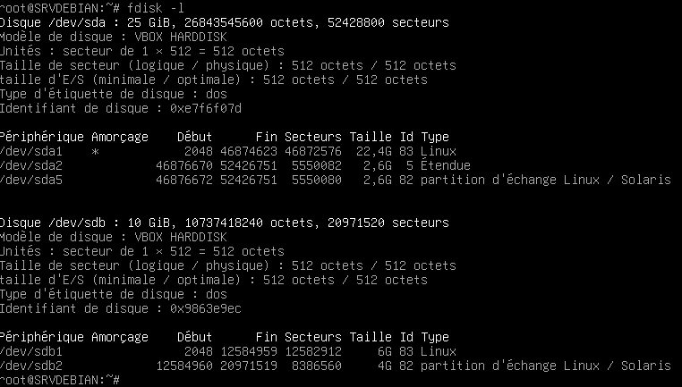

## Exercice 1 :

Création des partitions :  


On établit la partition 2 en swap :   


On regarde les partitions actuelles avec la commande ```fdisk -l``` , on a bien formé nos partitions, et il existe une partition swap : /dev/sda5 qu'on va dont désactiver :  


On désactive l'actuelle partition swap /dev/sda5 :  


On active la partition /dev/sdb2 en swap : (je n'y suis pas arrivé, puis je me suis dit que je ferai le changement dans /etc/fstab, même si ca veut peut etre dire que justement ca ne marchera pas... ?)  


On formate la partition /dev/sdb1 en ext 4 avec le label DATA pour donner le nom DATA :  


On créée un dossier /mnt/data puis on monte /dev/sdb1 dans ce dossier :  


On regarde le UUID de la partition /dev/sdb1 avec la commande ```blkid``` :  


On édite le fichier /etc/fstab pour qu'au redémarrage, les partitions soient gardées comme ça : (je ne me souvenais plus de la "3e colonne" : sw et ai du regarder mes notes)  


On vérifie avec la commande mount -a que ce qui est écrit en /etc/fstab existe (ce n'est pas une vérification que tout soit bon, juste qu'on ne se soit pas trompé de nom et que le dossier n'existe pas, ou qu'on ait fait une faute de frappe) :  

